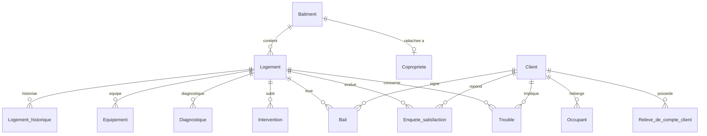

# Dictionnaire de données — Base `bailleur_social`

Base SQLite 3 (UTF-8) modélisant l'activité d'un bailleur social : patrimoine immobilier, locataires, baux, facturation, maintenance, diagnostics et satisfaction.

- **Tables** : 13
- **Date d'actualisation** : toutes les lignes portent `Date_actualisation = 2026-09-25`
- **Conventions** :
  - Dates stockées en `TEXT` au format ISO `YYYY-MM-DD`
  - Périodes mensuelles stockées en `TEXT` au format `YYYYMM` (ex. `202604`)
  - Indicateurs booléens stockés en `INTEGER` (`0` = non, `1` = oui)
  - Montants en euros (`REAL`)
  - Les libellés sont sans accents (ex. `Termine`, `Residence`)

---

## 1. Vue d'ensemble

| Table | Description | Lignes |
|---|---|---:|
| `Batiment` | Immeubles du parc | 30 |
| `Copropriete` | Copropriétés rattachées à un bâtiment (syndic, mandat) | 10 |
| `Logement` | Logements du parc | 433 |
| `Logement_historique` | Situation mensuelle de chaque logement | 2 598 |
| `Equipement` | Équipements installés dans les logements | 1 295 |
| `Diagnostique` | Diagnostics réglementaires des logements | 643 |
| `Intervention` | Interventions de maintenance | 500 |
| `Client` | Locataires titulaires | 220 |
| `Occupant` | Personnes occupant le logement d'un client | 171 |
| `Bail` | Baux liant un client à un logement | 220 |
| `Releve_de_compte_client` | Relevé mensuel de compte des clients | 2 640 |
| `Enquete_satisfaction` | Enquêtes de satisfaction | 160 |
| `Trouble` | Signalements de troubles (voisinage, dégradations…) | 140 |

> Note : la table s'appelle `Diagnostique` (orthographe de la base).

---

## 2. Relations (clés étrangères)

| Table enfant | Colonne | → Table parent | Colonne |
|---|---|---|---|
| `Copropriete` | `ID_batiment` | `Batiment` | `ID_batiment` |
| `Logement` | `ID_batiment` | `Batiment` | `ID_batiment` |
| `Logement_historique` | `ID_logement` | `Logement` | `ID_logement` |
| `Equipement` | `ID_logement` | `Logement` | `ID_logement` |
| `Diagnostique` | `ID_logement` | `Logement` | `ID_logement` |
| `Intervention` | `ID_logement` | `Logement` | `ID_logement` |
| `Bail` | `ID_logement` | `Logement` | `ID_logement` |
| `Bail` | `ID_client` | `Client` | `ID_client` |
| `Occupant` | `ID_client` | `Client` | `ID_client` |
| `Releve_de_compte_client` | `ID_client` | `Client` | `ID_client` |
| `Enquete_satisfaction` | `ID_client` | `Client` | `ID_client` |
| `Enquete_satisfaction` | `ID_logement` | `Logement` | `ID_logement` |
| `Trouble` | `ID_client` | `Client` | `ID_client` |
| `Trouble` | `ID_logement` | `Logement` | `ID_logement` |

Cardinalités observées : un bail par client et un bail par logement (relation 1-1 dans les données actuelles) ; une copropriété par bâtiment concerné (10 bâtiments sur 30).

---

## 3. Description des tables

Légende : **PK** = clé primaire, **FK** = clé étrangère, **Null** = nombre de valeurs nulles observées.

### 3.1 `Batiment`

Immeubles du parc géré (30 lignes).

| Colonne | Type | Clé | Description | Domaine / exemples | Null |
|---|---|---|---|---|---:|
| `ID_batiment` | INTEGER | PK | Identifiant technique du bâtiment | 1 à 30 | 0 |
| `Code_batiment` | TEXT | | Code métier du bâtiment | `BAT0001` … `BAT0030` | 0 |
| `Nom_batiment` | TEXT | | Nom de la résidence | `Residence Les Bleuets`, `Residence Le Hameau`, `Residence Les Tilleuls`, `Residence Les Peupliers`, `Residence Le Clos Fleuri`, `Residence Les Glycines`, `Residence Le Parc` | 0 |
| `Adresse` | TEXT | | Adresse postale (numéro et voie) | `167 rue des Lilas` | 0 |
| `Code_postal` | TEXT | | Code postal | `80000`, `60200`, `35000`… (9 valeurs) | 0 |
| `Ville` | TEXT | | Commune | Senlis, Rennes, Lanester, Amiens, Creil, Compiegne, Beauvais, Reims, Nantes | 0 |
| `Code_INSEE_commune` | TEXT | | Code INSEE de la commune | `80021`, `60159`, `60612`… | 0 |
| `Annee_construction` | INTEGER | | Année de construction | 1960 – 2020 | 0 |
| `Nombre_etages` | INTEGER | | Nombre d'étages | 2 – 8 | 0 |
| `Nombre_logements` | INTEGER | | Nombre de logements du bâtiment (cohérent avec le nombre de lignes `Logement` liées) | 5 – 24 | 0 |
| `Type_chauffage` | TEXT | | Mode de chauffage | `Reseau de chaleur`, `Individuel electrique`, `Collectif gaz`, `Collectif fioul` | 0 |
| `Classe_DPE` | TEXT | | Classe du diagnostic de performance énergétique | `A` à `G` | 0 |
| `Code_societe` | TEXT | | Société propriétaire / gestionnaire (pas de table de référence) | `SOC01`, `SOC02`, `SOC03` | 0 |
| `Date_actualisation` | TEXT | | Date de dernière mise à jour de la ligne | `2026-09-25` | 0 |

### 3.2 `Copropriete`

Copropriétés rattachées à un bâtiment, avec les informations du syndic (10 lignes).

| Colonne | Type | Clé | Description | Domaine / exemples | Null |
|---|---|---|---|---|---:|
| `ID_copropriete` | INTEGER | PK | Identifiant technique | 1 à 10 | 0 |
| `ID_batiment` | INTEGER | FK → `Batiment` | Bâtiment concerné | Valeurs uniques | 0 |
| `Nom_copropriete` | TEXT | | Nom de la copropriété | `Copropriete 1` … `Copropriete 10` | 0 |
| `ID_immatriculation` | TEXT | | Numéro d'immatriculation de la copropriété | `IMM00001` … `IMM00010` | 0 |
| `Nom_syndic` | TEXT | | Raison sociale du syndic | `Syndic Roux & Associes`, `Syndic Robert & Associes`… | 0 |
| `Adresse_syndic` | TEXT | | Adresse du syndic | `22 rue Voltaire` | 0 |
| `Telephone_syndic` | TEXT | | Téléphone du syndic | `0332817504` | 0 |
| `Mail_syndic` | TEXT | | E-mail du syndic | `syndic1@exemple.fr` | 0 |
| `Date_immatriculation` | TEXT | | Date d'immatriculation | 2005-04-27 → 2018-08-26 | 0 |
| `Total_tantiemes` | INTEGER | | Total des tantièmes de la copropriété | 1 064 – 8 771 | 0 |
| `Etat_mandat` | TEXT | | État du mandat du syndic | `En attente AG` (5), `Actif` (4), `Renouvele` (1) | 0 |
| `Date_fin_mandat` | TEXT | | Date de fin du mandat | 2026-10-13 → 2029-04-24 | 0 |
| `Date_actualisation` | TEXT | | Date de dernière mise à jour | `2026-09-25` | 0 |

### 3.3 `Logement`

Logements du parc (433 lignes).

| Colonne | Type | Clé | Description | Domaine / exemples | Null |
|---|---|---|---|---|---:|
| `ID_logement` | INTEGER | PK | Identifiant technique du logement | 1 à 433 | 0 |
| `Code_logement` | TEXT | | Code métier du logement | `LOG00001` … `LOG00433` | 0 |
| `ID_batiment` | INTEGER | FK → `Batiment` | Bâtiment d'appartenance | 1 à 30 | 0 |
| `Etage` | INTEGER | | Étage du logement | 0 – 7 | 0 |
| `Numero_porte` | TEXT | | Numéro de porte sur le palier | `1` à `6` | 0 |
| `Type_logement` | TEXT | | Typologie | `T1`, `T2`, `T3`, `T4`, `T5` | 0 |
| `Surface_habitable` | REAL | | Surface habitable en m² | 28,1 – 95,0 | 0 |
| `Nombre_pieces` | INTEGER | | Nombre de pièces | 1 – 5 | 0 |
| `Code_categorie_financement` | TEXT | | Catégorie de financement du logement social | `PLS`, `PLUS`, `PLAI`, `Intermediaire` | 0 |
| `Code_etat_actuel` | TEXT | | État actuel d'occupation | `Loue` (121), `Preavis` (111), `Libre` (105), `Travaux` (96) | 0 |
| `Date_mise_en_service` | TEXT | | Date de mise en service | 1990-03-06 → 2020-09-02 | 0 |
| `Loyer_reference` | REAL | | Loyer de référence mensuel (€) | 214,34 – 981,20 | 0 |
| `Indicateur_accessibilite_PMR` | INTEGER | | Logement accessible PMR (`1` = oui) | `0` (333), `1` (100) | 0 |
| `Date_actualisation` | TEXT | | Date de dernière mise à jour | `2026-09-25` | 0 |

### 3.4 `Logement_historique`

Photographie mensuelle de chaque logement : une ligne par logement et par mois (433 logements × 6 mois).

| Colonne | Type | Clé | Description | Domaine / exemples | Null |
|---|---|---|---|---|---:|
| `ID_logement_historique` | INTEGER | PK | Identifiant technique | 1 à 2 598 | 0 |
| `ID_logement` | INTEGER | FK → `Logement` | Logement concerné | 1 à 433 | 0 |
| `Annee_mois` | TEXT | | Mois concerné (`YYYYMM`) | `202604` → `202609` | 0 |
| `Code_etat` | TEXT | | État du logement sur le mois | `Loue` (2 252), `Travaux` (179), `Libre` (167) | 0 |
| `Loyer_applique` | REAL | | Loyer appliqué sur le mois (€) | 205,02 – 998,18 | 0 |
| `Charges_appliquees` | REAL | | Charges appliquées sur le mois (€) | 32,15 – 147,18 | 0 |
| `Indicateur_vacance` | INTEGER | | Logement vacant sur le mois (`1` = oui) | `0` (2 074), `1` (524) | 0 |
| `Nombre_jours_vacance` | INTEGER | | Nombre de jours de vacance dans le mois | 0 – 30 | 0 |
| `Date_actualisation` | TEXT | | Date de dernière mise à jour | `2026-09-25` | 0 |

Unicité observée du couple (`ID_logement`, `Annee_mois`).

### 3.5 `Equipement`

Équipements techniques des logements (1 295 lignes).

| Colonne | Type | Clé | Description | Domaine / exemples | Null |
|---|---|---|---|---|---:|
| `ID_equipement` | INTEGER | PK | Identifiant technique | 1 à 1 295 | 0 |
| `ID_logement` | INTEGER | FK → `Logement` | Logement équipé | 1 à 433 | 0 |
| `Code_famille_equipement` | TEXT | | Famille d'équipement | `Ouvrants`, `Ventilation`, `Chauffage`, `Sanitaire`, `Cuisine` | 0 |
| `Code_type_equipement` | TEXT | | Type d'équipement | `Volet roulant`, `VMC simple flux`, `VMC double flux`, `Hotte`, `Robinetterie`, `Fenetre PVC`, `Chauffe-eau`, `Plaque de cuisson`, `Chaudiere`, `Radiateur electrique`, `PAC` | 0 |
| `Marque` | TEXT | | Marque du fabricant | `De Dietrich`, `Saunier Duval`, `Velux`, `Thermor`, `Atlantic`, `Chaffoteaux`, `Aldes` | 0 |
| `Modele` | TEXT | | Référence du modèle | `MOD-100` … `MOD-999` | 0 |
| `Date_installation` | TEXT | | Date d'installation | 2005-01-05 → 2023-09-21 | 0 |
| `Date_fin_de_service` | TEXT | | Date de fin de service | Toujours vide | 1 295 |
| `Etat_equipement` | TEXT | | État de l'équipement | `A remplacer` (442), `Moyen` (437), `Bon` (416) | 0 |
| `Date_actualisation` | TEXT | | Date de dernière mise à jour | `2026-09-25` | 0 |

### 3.6 `Diagnostique`

Diagnostics réglementaires réalisés sur les logements (643 lignes).

| Colonne | Type | Clé | Description | Domaine / exemples | Null |
|---|---|---|---|---|---:|
| `ID_diagnostic` | INTEGER | PK | Identifiant technique | 1 à 643 | 0 |
| `ID_logement` | INTEGER | FK → `Logement` | Logement diagnostiqué | 1 à 433 | 0 |
| `Type_diagnostic` | TEXT | | Type de diagnostic | `Electricite` (119), `Plomb` (113), `Termites` (109), `Amiante` (107), `Gaz` (99), `DPE` (96) | 0 |
| `Date_debut_diagnostic` | TEXT | | Date de début | 2018-01-10 → 2025-09-25 | 0 |
| `Date_fin_diagnostic` | TEXT | | Date de fin | Identique à la date de début dans toutes les lignes | 0 |
| `Resultat_diagnostic` | TEXT | | Résultat | `A surveiller` (222), `Conforme` (212), `Non conforme` (209) | 0 |
| `Indicateur_perime` | INTEGER | | Diagnostic périmé (`1` = oui) | `0` (421), `1` (222) | 0 |
| `Nombre_jours_avant_peremption` | INTEGER | | Jours restants avant péremption (négatif = dépassé) | -99 – 898 | 0 |
| `Date_actualisation` | TEXT | | Date de dernière mise à jour | `2026-09-25` | 0 |

### 3.7 `Intervention`

Interventions de maintenance sur les logements (500 lignes).

| Colonne | Type | Clé | Description | Domaine / exemples | Null |
|---|---|---|---|---|---:|
| `ID_intervention` | INTEGER | PK | Identifiant technique | 1 à 500 | 0 |
| `ID_logement` | INTEGER | FK → `Logement` | Logement concerné | 1 à 432 (301 logements distincts) | 0 |
| `Type_intervention` | TEXT | | Corps de métier | `Peinture`, `Plomberie`, `Espaces verts`, `Electricite`, `Serrurerie`, `Menage parties communes`, `Chauffage` | 0 |
| `Libelle_intervention` | TEXT | | Libellé de l'intervention | `Intervention plomberie`, `Intervention peinture`… | 0 |
| `Prestataire` | TEXT | | Entreprise intervenante | `ElecPro`, `PlombServices`, `ArtisansReunis`, `Entreprise Dubois SARL`, `VertPaysage` | 0 |
| `Date_enregistrement` | TEXT | | Date d'enregistrement de la demande | 2023-01-08 → 2026-09-21 | 0 |
| `Date_realisation` | TEXT | | Date de réalisation | Identique à la date d'enregistrement dans toutes les lignes | 0 |
| `Montant_HT` | REAL | | Montant hors taxes (€) | 52,62 – 1 199,49 | 0 |
| `Montant_TTC` | REAL | | Montant toutes taxes comprises (€) | 61,19 – 1 449,58 | 0 |
| `Statut_intervention` | TEXT | | Statut | `Realisee` (132), `Planifiee` (125), `Annulee` (124), `En cours` (119) | 0 |
| `Date_actualisation` | TEXT | | Date de dernière mise à jour | `2026-09-25` | 0 |

### 3.8 `Client`

Locataires titulaires (220 lignes). Contient des données personnelles.

| Colonne | Type | Clé | Description | Domaine / exemples | Null |
|---|---|---|---|---|---:|
| `ID_client` | INTEGER | PK | Identifiant technique du client | 1 à 220 | 0 |
| `Nom_client` | TEXT | | Nom de famille | 30 valeurs distinctes | 0 |
| `Prenom_client` | TEXT | | Prénom | 30 valeurs distinctes | 0 |
| `Date_naissance` | TEXT | | Date de naissance | 1945-03-08 → 2005-05-12 | 0 |
| `Annee_revenus` | INTEGER | | Année de référence des revenus | 2021 – 2025 | 0 |
| `Montant_revenus` | REAL | | Revenus annuels du ménage (€) | 8 064,74 – 41 854,96 | 0 |
| `Code_categorie_menage` | TEXT | | Composition du ménage | `Colocation` (55), `Couple sans enfant` (48), `Famille monoparentale` (43), `Personne seule` (39), `Couple avec enfants` (35) | 0 |
| `Mail_client` | TEXT | | Adresse e-mail | `prenom.nom@exemple.fr` | 0 |
| `Telephone_client` | TEXT | | Téléphone | `0870225523` | 0 |
| `Adresse_temporaire` | TEXT | | Adresse temporaire | Toujours vide | 220 |
| `Date_actualisation` | TEXT | | Date de dernière mise à jour | `2026-09-25` | 0 |

### 3.9 `Occupant`

Personnes vivant dans le logement d'un client titulaire (171 lignes, 91 clients concernés).

| Colonne | Type | Clé | Description | Domaine / exemples | Null |
|---|---|---|---|---|---:|
| `ID_occupant` | INTEGER | PK | Identifiant technique | 1 à 171 | 0 |
| `ID_client` | INTEGER | FK → `Client` | Client titulaire de rattachement | 1 à 217 | 0 |
| `Nom_occupant` | TEXT | | Nom de famille | 30 valeurs distinctes | 0 |
| `Prenom_occupant` | TEXT | | Prénom | 30 valeurs distinctes | 0 |
| `Date_naissance` | TEXT | | Date de naissance | 1970-02-20 → 2020-08-08 | 0 |
| `Lien_parente` | TEXT | | Lien avec le titulaire | `Enfant` (63), `Conjoint` (56), `Autre` (52) | 0 |
| `Date_entree` | TEXT | | Date d'entrée dans le logement | 2018-01-10 → 2026-09-11 | 0 |
| `Date_actualisation` | TEXT | | Date de dernière mise à jour | `2026-09-25` | 0 |

### 3.10 `Bail`

Contrats de location entre un client et un logement (220 lignes).

| Colonne | Type | Clé | Description | Domaine / exemples | Null |
|---|---|---|---|---|---:|
| `ID_bail` | INTEGER | PK | Identifiant technique du bail | 1 à 220 | 0 |
| `ID_client` | INTEGER | FK → `Client` | Locataire titulaire | 1 à 220 (unique) | 0 |
| `ID_logement` | INTEGER | FK → `Logement` | Logement loué | 2 à 430 (unique) | 0 |
| `Type_bail` | TEXT | | Type de bail | `Bail glissant` (86), `Sous-location autorisee` (71), `Bail principal` (63) | 0 |
| `Date_debut_occupation` | TEXT | | Date de début d'occupation | 2015-01-08 → 2025-09-05 | 0 |
| `Date_fin_occupation` | TEXT | | Date de fin d'occupation (vide si bail en cours) | 2020-02-28 → 2026-07-14 | 165 |
| `Montant_loyer` | REAL | | Loyer mensuel hors charges (€) | 350,09 – 849,08 | 0 |
| `Montant_charges` | REAL | | Charges mensuelles (€) | 52,51 – 127,36 | 0 |
| `Date_reception_preavis` | TEXT | | Date de réception du préavis | 2020-01-17 → 2026-08-12 | 165 |
| `Statut_bail` | TEXT | | Statut du bail | `En cours` (165), `Termine` (55) | 0 |
| `Date_actualisation` | TEXT | | Date de dernière mise à jour | `2026-09-25` | 0 |

Les 165 valeurs nulles de `Date_fin_occupation` et de `Date_reception_preavis` correspondent aux baux `En cours`.

### 3.11 `Releve_de_compte_client`

Relevé mensuel de compte de chaque client : 220 clients × 12 mois (2 640 lignes).

| Colonne | Type | Clé | Description | Domaine / exemples | Null |
|---|---|---|---|---|---:|
| `ID_releve` | INTEGER | PK | Identifiant technique | 1 à 2 640 | 0 |
| `ID_client` | INTEGER | FK → `Client` | Client concerné | 1 à 220 | 0 |
| `Annee_mois` | TEXT | | Mois concerné (`YYYYMM`) | `202510` → `202609` | 0 |
| `Montant_loyer` | REAL | | Loyer appelé (€), égal au loyer du bail | 350,09 – 849,08 | 0 |
| `Montant_charges` | REAL | | Charges appelées (€), égales aux charges du bail | 52,51 – 127,36 | 0 |
| `Montant_APL` | REAL | | Aide personnalisée au logement perçue (€) | 0,02 – 199,86 | 0 |
| `Montant_paye` | REAL | | Montant effectivement payé (€) | 0,00 – 963,15 | 0 |
| `Montant_impaye` | REAL | | Montant impayé (€) | 0,00 – 956,26 | 0 |
| `Classe_montant_impaye` | TEXT | | Classe de l'impayé | `Aucun` (1 619, impayé = 0), `Eleve` (1 018, ≥ 100,28 €), `Faible` (3, 87,85 – 98,82 €) | 0 |
| `Solde_client` | REAL | | Solde du compte client (€) | -49,97 – 49,99 | 0 |
| `Date_actualisation` | TEXT | | Date de dernière mise à jour | `2026-09-25` | 0 |

### 3.12 `Enquete_satisfaction`

Enquêtes de satisfaction auprès des locataires (160 lignes, 117 clients distincts).

| Colonne | Type | Clé | Description | Domaine / exemples | Null |
|---|---|---|---|---|---:|
| `ID_enquete` | INTEGER | PK | Identifiant technique | 1 à 160 | 0 |
| `ID_client` | INTEGER | FK → `Client` | Client interrogé | 1 à 220 | 0 |
| `ID_logement` | INTEGER | FK → `Logement` | Logement concerné (cohérent avec le bail du client) | 5 à 430 | 0 |
| `Date_enquete` | TEXT | | Date de l'enquête | 2024-01-01 → 2026-09-21 | 0 |
| `Note_globale` | INTEGER | | Note globale (1 = très insatisfait, 5 = très satisfait) | 1 – 5 | 0 |
| `Note_logement` | INTEGER | | Note du logement | 1 – 5 | 0 |
| `Note_proprete_parties_communes` | INTEGER | | Note de propreté des parties communes | 1 – 5 | 0 |
| `Note_reactivite_service` | INTEGER | | Note de réactivité du service | 1 – 5 | 0 |
| `Indicateur_recommandation` | INTEGER | | Le client recommande le bailleur (`1` = oui) | `0` (101), `1` (59) | 0 |
| `Commentaire` | TEXT | | Commentaire libre (liste fermée de 5 valeurs) | `Bon accueil de l'agence`, `RAS`, `Probleme de chauffage recurrent`, `Delai intervention trop long`, `Tres satisfait du logement` | 30 |
| `Date_actualisation` | TEXT | | Date de dernière mise à jour | `2026-09-25` | 0 |

### 3.13 `Trouble`

Signalements de troubles et de manquements (140 lignes, 90 clients distincts).

| Colonne | Type | Clé | Description | Domaine / exemples | Null |
|---|---|---|---|---|---:|
| `ID_trouble` | INTEGER | PK | Identifiant technique | 1 à 140 | 0 |
| `ID_logement` | INTEGER | FK → `Logement` | Logement concerné | 2 à 429 | 0 |
| `ID_client` | INTEGER | FK → `Client` | Client concerné | 4 à 219 | 0 |
| `Type_trouble` | TEXT | | Nature du trouble | `Degradation` (32), `Animaux non declares` (31), `Conflit voisinage` (23), `Nuisance sonore` (19), `Sous-location illegale` (18), `Depot sauvage` (17) | 0 |
| `Date_signalement` | TEXT | | Date du signalement | 2023-01-10 → 2026-09-23 | 0 |
| `Date_resolution` | TEXT | | Date de résolution (vide si non résolu) | 2023-01-23 → 2026-09-21 | 46 |
| `Statut_trouble` | TEXT | | Statut | `Resolu` (94), `En cours` (26), `En attente` (20) | 0 |
| `Description` | TEXT | | Description libre (liste fermée de 6 valeurs `Signalement …`) | `Signalement depot sauvage`, `Signalement degradation`… | 0 |
| `Date_actualisation` | TEXT | | Date de dernière mise à jour | `2026-09-25` | 0 |

Les 46 valeurs nulles de `Date_resolution` correspondent aux troubles `En cours` (26) et `En attente` (20).

---

## 4. Points d'attention sur la qualité des données

Constats issus du profilage de la base (à vérifier ou à traiter selon l'usage) :

| # | Constat | Table(s) |
|---|---|---|
| 1 | Colonnes entièrement vides : `Adresse_temporaire` (220/220), `Date_fin_de_service` (1 295/1 295) | `Client`, `Equipement` |
| 2 | `Date_actualisation` identique sur toutes les lignes de toutes les tables (`2026-09-25`) | Toutes |
| 3 | `Montant_TTC` inférieur à `Montant_HT` dans 199 interventions sur 500 | `Intervention` |
| 4 | `Date_realisation` = `Date_enregistrement` dans 100 % des interventions, y compris `Planifiee`, `En cours` et `Annulee` | `Intervention` |
| 5 | `Date_resolution` antérieure à `Date_signalement` dans 49 troubles | `Trouble` |
| 6 | `Date_fin_occupation` antérieure à `Date_debut_occupation` dans 15 baux | `Bail` |
| 7 | `Date_fin_diagnostic` = `Date_debut_diagnostic` dans 100 % des diagnostics | `Diagnostique` |
| 8 | `Nombre_jours_avant_peremption` négatif y compris quand `Indicateur_perime = 0` (min -97) | `Diagnostique` |
| 9 | `Nombre_pieces` non cohérent avec `Type_logement` (ex. des `T1` à 5 pièces) | `Logement` |
| 10 | `Indicateur_vacance = 1` sur 178 lignes à l'état `Loue` | `Logement_historique` |
| 11 | `Code_etat_actuel` de `Logement` (`Loue` = 121 logements) non aligné avec les 220 baux (165 `En cours`) | `Logement`, `Bail` |
| 12 | Classe `Faible` quasi inexistante (3 lignes) face à `Eleve` (1 018) pour les impayés | `Releve_de_compte_client` |
| 13 | 19 adresses e-mail en doublon (homonymes) | `Client` |
| 14 | `Code_societe` n'a pas de table de référence ; aucune contrainte de clé étrangère sur les codes (`Code_categorie_menage`, `Code_categorie_financement`, etc.) | `Batiment`, `Logement`, `Client` |
| 15 | Aucune contrainte `NOT NULL`, `UNIQUE` ou `CHECK` déclarée dans le schéma | Toutes |
| 16 | Les 220 enregistrements `Client`, `Occupant`, `Bail` contiennent des données personnelles (nom, naissance, revenus, contact) : attention RGPD | `Client`, `Occupant` |

> Les données semblent synthétiques (e-mails en `@exemple.fr`, libellés génériques), ce qui explique une partie de ces incohérences.