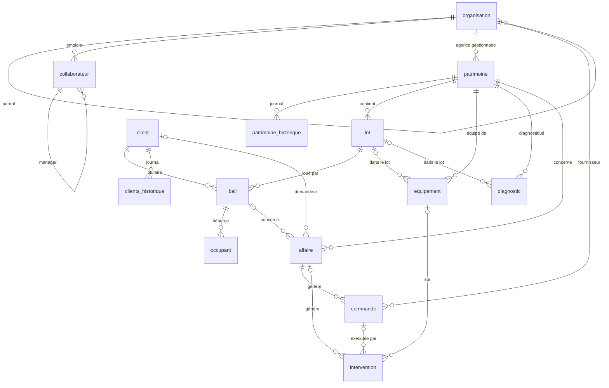

# Dictionnaire de données — base fictive « Bailleur social »

> Fichier : `bailleur_social_test.db` (SQLite) · Données **purement fictives** · Date de référence des données : **2026-10-02**.
> Ce document est généré automatiquement depuis la base (structure, volumes, taux de NULL, valeurs réelles) et complété par les descriptions métier. Il est fait pour être lu par un humain **et** injecté tel quel dans le contexte d'un agent / d'un serveur MCP.

## 1. Vue d'ensemble

| Table | Rôle | Lignes |
|---|---|---:|
| [`organisation`](#organisation) | Siège, directions, agences, prestataires, collectivités, financeurs | 27 |
| [`collaborateur`](#collaborateur) | Salariés du bailleur (siège, directions, agences) | 95 |
| [`patrimoine`](#patrimoine) | Bâtiments collectifs et maisons individuelles | 75 |
| [`patrimoine_historique`](#patrimoine_historique) | Journal des modifications d'un patrimoine | 210 |
| [`lot`](#lot) | Logements et stationnements d'un patrimoine | 1 151 |
| [`client`](#client) | Locataires, anciens locataires, candidats, associations | 2 614 |
| [`clients_historique`](#clients_historique) | Journal des modifications d'un client | 10 477 |
| [`bail`](#bail) | Contrats de location (actifs et historiques) | 2 699 |
| [`occupant`](#occupant) | Personnes vivant dans le logement pour un bail | 5 272 |
| [`equipement`](#equipement) | Équipements techniques (logements et parties communes) | 3 415 |
| [`diagnostic`](#diagnostic) | Diagnostics techniques et réglementaires (DPE, amiante...) | 2 164 |
| [`affaire`](#affaire) | Dossiers de gestion (réclamations, travaux, impayés, sinistres...) | 2 300 |
| [`commande`](#commande) | Bons de commande aux prestataires | 895 |
| [`intervention`](#intervention) | Passages de techniciens (prestataires ou régie) | 2 790 |

### Conventions techniques (à respecter dans les requêtes)

- **Dates** : colonnes `TEXT` au format ISO `AAAA-MM-JJ`. Comparaisons directes possibles (`date_debut >= '2025-01-01'`), 
  calculs avec `julianday()` ou `strftime()`. Il n'y a pas d'heure.
- **« Aujourd'hui »** : les données sont figées au **2026-10-02**. Utiliser ce littéral plutôt que `date('now')` pour obtenir des résultats cohérents (retards, expirations, statuts calculés).
- **Booléens** : entiers `0` / `1` (pas de `TRUE`/`FALSE`). Ex. `ascenseur`, `actif`, `balcon`, `locataire_absent`.
- **Montants** : `REAL` en euros. Loyers et charges sont **mensuels**. Les montants de `commande` sont en HT / TVA / TTC.
- **Énumérations** : colonnes `TEXT` à valeurs fermées, **en MAJUSCULES avec underscores** (`EN_COURS`, `VACANT_TRAVAUX`). 
  Elles sont contrôlées par des `CHECK` — filtrer avec la valeur exacte (la comparaison SQLite est sensible à la casse).
- **Clés** : chaque table a une clé primaire entière `id`. Les clés étrangères sont nommées `<table>_id` 
  (sauf exceptions : `fournisseur_id`, `prestataire_id`, `organisation_gestion_id`, `collaborateur_*_id`... → voir les tables). 
  Les clés étrangères **ne sont pas appliquées par défaut** en SQLite : lancer `PRAGMA foreign_keys = ON;` si besoin.
- **NULL** : une colonne NULL signifie « sans objet » ou « pas encore » (ex. `date_fin_effective` d'un bail en cours). 
  Toujours utiliser `IS NULL` / `IS NOT NULL`, jamais `= NULL`.
- **Identifiants métier** (`code`, `numero_*`) sont uniques et stables ; les `id` sont techniques.
- **Texte libre** : accents présents (é, è, ç) ; faire attention aux `LIKE` (SQLite est insensible à la casse seulement pour l'ASCII).

### Schéma relationnel



### Chemins de jointure usuels

| Besoin | Chemin |
|---|---|
| Logement → immeuble → agence | `lot.patrimoine_id → patrimoine.id → patrimoine.organisation_gestion_id → organisation.id` |
| Qui loue ce lot ? | `lot.id ← bail.lot_id` (filtrer `bail.statut IN ('EN_COURS','PREAVIS')`) puis `bail.client_id → client.id` |
| Qui habite le logement ? | `bail.id ← occupant.bail_id` |
| Locataire → gestionnaire | `bail.collaborateur_gestionnaire_id → collaborateur.id` (ou `client.collaborateur_referent_id`) |
| Réclamation → équipement → prestataire | `affaire.id ← intervention.affaire_id`, `intervention.equipement_id → equipement.id`, `equipement.prestataire_id → organisation.id` |
| Coût d'une affaire | `affaire.id ← commande.affaire_id` (somme de `montant_ttc`, hors `ANNULEE`) |
| Parties communes d'un immeuble | `equipement` / `diagnostic` / `affaire` / `intervention` avec `patrimoine_id = X AND lot_id IS NULL` |
| Prestataire d'une commande ou d'une intervention | `commande.fournisseur_id → organisation.id` ; `intervention.intervenant_organisation_id → organisation.id` |

### Règles métier et pièges à connaître

1. **Bail actif** = `bail.statut IN ('EN_COURS','PREAVIS')`. Un lot n'a jamais plus d'un bail actif. Les baux `TERMINE`/`RESILIE` constituent l'historique d'occupation ; `EN_ATTENTE` = attribution future.
2. **Un lot peut avoir plusieurs baux** au fil du temps → ne jamais supposer `lot ↔ bail` en 1-1 ; filtrer sur le statut ou la date.
3. **Logements vs stationnements** : `lot.type_lot` distingue les deux. Pour compter les logements, filtrer `type_lot='LOGEMENT'` (sinon les parkings faussent les totaux). Les baux de parking ont `type_bail='STATIONNEMENT'` — les exclure des calculs de loyer d'habitation / de nombre de ménages.
4. **Vacance** = lot logement en `VACANT` ou `VACANT_TRAVAUX` (exclure `EN_CONSTRUCTION`, `VENDU`, `RESERVE`).
5. **Dette** : `bail.solde_compte > 0`. Ne compter que les baux actifs pour la dette « courante » ; les baux terminés avec solde > 0 sont des dettes de sortants.
6. **Préavis** : pour un bail `PREAVIS`, `date_fin_effective` est **dans le futur**. Pour un bail `EN_COURS`, elle est NULL.
7. **Parties communes** : `lot_id IS NULL` dans `equipement`, `diagnostic`, `affaire`, `intervention`.
8. **Intervention sans affaire** : les entretiens préventifs et contrôles réglementaires ont `affaire_id IS NULL` — un `JOIN affaire` direct les ferait disparaître (utiliser `LEFT JOIN`).
9. **Intervenant** : exactement un des deux champs `intervenant_organisation_id` (prestataire) ou `intervenant_collaborateur_id` (régie) est renseigné.
10. **Personnes morales** : un `client` de type `PERSONNE_MORALE` n'a ni nom/prénom ni revenus ; utiliser `COALESCE(raison_sociale, nom || ' ' || prenom)` pour un libellé unique.
11. **Titulaire = occupant** : le titulaire apparaît dans `occupant` (`lien_titulaire='TITULAIRE'`). Pour compter les *autres* personnes du foyer, exclure cette ligne.
12. **Historiques** : `clients_historique` / `patrimoine_historique` ne contiennent que des changements ponctuels, pas un instantané complet. Les valeurs sont en texte (même pour des nombres).
13. **Statuts calculés** : `diagnostic.statut` est figé à la date de référence 2026-10-02. 
14. **Colonnes dérivées** : `patrimoine.nb_lots` et `surface_habitable_totale` sont stockées ; en cas de doute, recalculer depuis `lot`.
15. **Valeurs de `resultat`** (diagnostic) dépendent du type : DPE = `REALISE` ; amiante = `ABSENCE_AMIANTE`/`PRESENCE_MATERIAUX_NON_DEGRADES`/`A_SURVEILLER` ; électricité/gaz/ascenseur = `CONFORME`/`ANOMALIES_MINEURES`/`NON_CONFORME` ; termites/plomb = `ABSENCE`/`PRESENCE...`.

## 2. Détail des tables

### organisation

Toutes les entités « personnes morales » : le bailleur lui-même (siège, directions, agences), ses prestataires (artisans, sociétés de maintenance), les collectivités et les financeurs.

**Volume** : 27 lignes.

**Règles et particularités :**

- `type_organisation` détermine le rôle ; `specialite` n'est renseignée que pour `PRESTATAIRE`.
- Hiérarchie par `organisation_parent_id` (agence et direction → siège).
- Une **agence** (`type_organisation='AGENCE'`) gère un portefeuille de patrimoine (`patrimoine.organisation_gestion_id`).
- Un **prestataire** est référencé comme fournisseur d'une commande, intervenant d'une intervention, ou diagnostiqueur.

| Colonne | Type | Clé | Null % | Description | Valeurs possibles / exemple |
|---|---|---|---:|---|---|
| `id` | INTEGER | PK | 0 | Identifiant technique. | 1 … 27 |
| `code` | TEXT |  | 0 | Code métier unique (ORG-AGx, PRE-xxx, EXT-xxx...). | ex. `ORG-AG4` |
| `nom` | TEXT |  | 0 | Nom de l'organisation. | ex. `Agence Saint-Malo` |
| `type_organisation` | TEXT |  | 0 | Rôle de l'organisation. | `SIEGE` (1), `DIRECTION` (4), `AGENCE` (5), `PRESTATAIRE` (13), `COLLECTIVITE` (2), `FINANCEUR` (2) |
| `specialite` | TEXT |  | 52 | Métier du prestataire (PLOMBERIE, CHAUFFAGE, ASCENSEUR, ELECTRICITE, MENUISERIE, SERRURERIE, ETANCHEITE, PEINTURE, NETTOYAGE, ESPACES_VERTS, DIAGNOSTIC). | `PLOMBERIE` (2), `CHAUFFAGE` (2), `SERRURERIE` (1), `PEINTURE` (1), `NETTOYAGE` (1), `MENUISERIE` (1), `ETANCHEITE` (1), `ESPACES_VERTS` (1), `ELECTRICITE` (1), `DIAGNOSTIC` (1), `ASCENSEUR` (1) |
| `organisation_parent_id` | INTEGER | FK → organisation.id | 67 | Organisation de rattachement (FK → organisation). | ex. `1` |
| `siret` | TEXT |  | 0 | SIRET fictif (14 chiffres). | ex. `90845205997283` |
| `adresse` | TEXT |  | 0 | Adresse postale. | ex. `61 avenue Jules Ferry` |
| `code_postal` | TEXT |  | 0 | Code postal. | ex. `35400` |
| `ville` | TEXT |  | 0 | Ville. | ex. `Saint-Malo` |
| `telephone` | TEXT |  | 0 | Téléphone (numéro fictif). | ex. `02 61 91 16 76` |
| `email` | TEXT |  | 0 | E-mail générique (domaine réservé .example). | ex. `contact@agence.saint.malo.example` |
| `site_web` | TEXT |  | 0 | Site web fictif. | ex. `https://www.agence.saint.malo.example` |
| `contact_nom` | TEXT |  | 0 | Nom du contact principal. | ex. `Nathan Bonnet` |
| `date_debut_contrat` | TEXT |  | 52 | Début du marché (prestataires). | ex. `2024-05-16` |
| `date_fin_contrat` | TEXT |  | 52 | Fin du marché (prestataires). | ex. `2028-10-06` |
| `note_qualite` | REAL |  | 52 | Note de qualité de 0 à 5 (prestataires). | ex. `3.1` |
| `actif` | INTEGER |  | 0 | 1 = organisation active, 0 = inactive. | ex. `1` |
| `date_creation` | TEXT |  | 0 | Date de création de la fiche. | ex. `2005-01-01` |

**Référencée par :** `organisation.organisation_parent_id`, `collaborateur.organisation_id`, `patrimoine.organisation_gestion_id`, `equipement.prestataire_id`, `diagnostic.diagnostiqueur_organisation_id`, `affaire.organisation_id`, `commande.fournisseur_id`, `intervention.intervenant_organisation_id`

### collaborateur

Salariés du bailleur, rattachés à une organisation (siège, direction ou agence).

**Volume** : 95 lignes.

**Règles et particularités :**

- Hiérarchie par `manager_id` (auto-référence).
- `fonction` utiles : « Responsable d'agence », « Gestionnaire locatif », « Conseiller social », « Chargé de recouvrement », « Technicien patrimoine », « Chargé de proximité ».

| Colonne | Type | Clé | Null % | Description | Valeurs possibles / exemple |
|---|---|---|---:|---|---|
| `id` | INTEGER | PK | 0 | Identifiant technique. | 1 … 95 |
| `matricule` | TEXT |  | 0 | Matricule RH unique (M1xxxx). | ex. `M10008` |
| `civilite` | TEXT |  | 0 | M ou Mme. | `Mme` (50), `M` (45) |
| `nom` | TEXT |  | 0 | Nom. | ex. `Fournier` |
| `prenom` | TEXT |  | 0 | Prénom. | ex. `Maëlle` |
| `email` | TEXT |  | 0 | E-mail professionnel (unique). | ex. `aurelie.garcia.39@armor-habitat.example` |
| `telephone` | TEXT |  | 0 | Téléphone fixe fictif. | ex. `02 61 91 10 72` |
| `fonction` | TEXT |  | 0 | Intitulé du poste. | ex. `Analyste` |
| `service` | TEXT |  | 0 | Service (Gestion locative, Technique, Recouvrement, Proximité...). | `Gestion locative` (20), `Direction` (20), `Technique` (15), `Proximité` (10), `Action sociale` (10), `Recouvrement` (5), `Direction d'agence` (5), `Administration` (5), `Services généraux` (4), `Direction générale` (1) |
| `organisation_id` | INTEGER | FK → organisation.id | 0 | Organisation d'affectation (FK → organisation). | ex. `2` |
| `manager_id` | INTEGER | FK → collaborateur.id | 1 | Responsable hiérarchique (FK → collaborateur). | ex. `6` |
| `type_contrat` | TEXT |  | 0 | Type de contrat. | `CDI` (73), `CDD` (7), `ALTERNANCE` (3), `FONCTIONNAIRE` (12) |
| `date_embauche` | TEXT |  | 0 | Date d'embauche. | ex. `2016-09-14` |
| `date_sortie` | TEXT |  | 95 | Date de départ (NULL si toujours en poste). |  |
| `actif` | INTEGER |  | 0 | 1 = en poste, 0 = parti. | ex. `1` |

**Référencée par :** `collaborateur.manager_id`, `patrimoine.collaborateur_gestionnaire_id`, `patrimoine_historique.collaborateur_id`, `client.collaborateur_referent_id`, `clients_historique.collaborateur_id`, `bail.collaborateur_gestionnaire_id`, `affaire.collaborateur_id`, `commande.collaborateur_id`, `intervention.intervenant_collaborateur_id`

### patrimoine

Biens immobiliers : un **bâtiment** collectif (qui contient des lots) ou un **logement** individuel (maison). C'est le niveau « immeuble ».

**Volume** : 75 lignes.

**Règles et particularités :**

- Un patrimoine contient 1..n `lot` (`lot.patrimoine_id`).
- `type_patrimoine='LOGEMENT'` = maison individuelle (1 lot logement + éventuellement 1 garage).
- `nb_lots` et `surface_habitable_totale` sont des valeurs dérivées des lots (la surface ne compte que les lots `LOGEMENT`).
- `statut='EN_CONSTRUCTION'` : lots non louables, `date_mise_en_service` dans le futur (2027).

| Colonne | Type | Clé | Null % | Description | Valeurs possibles / exemple |
|---|---|---|---:|---|---|
| `id` | INTEGER | PK | 0 | Identifiant technique. | 1 … 75 |
| `code` | TEXT |  | 0 | Code métier unique (PAT-0001...). | ex. `PAT-0008` |
| `type_patrimoine` | TEXT |  | 0 | Bâtiment collectif ou maison individuelle. | `BATIMENT` (45), `LOGEMENT` (30) |
| `nom_residence` | TEXT |  | 40 | Nom commercial de la résidence (bâtiments uniquement). | ex. `Le Clos Genêts` |
| `adresse` | TEXT |  | 0 | Numéro et voie. | ex. `56 allée des Genêts` |
| `code_postal` | TEXT |  | 0 | Code postal. | ex. `35200` |
| `ville` | TEXT |  | 0 | Ville. | ex. `Bruz` |
| `quartier` | TEXT |  | 0 | Quartier. | `Centre` (49), `Villejean` (8), `Rocabey` (7), `Ménimur` (5), `Kervénanec` (5), `Le Blosne` (1) |
| `latitude` | REAL |  | 0 | Latitude WGS84. | ex. `48.088175` |
| `longitude` | REAL |  | 0 | Longitude WGS84. | ex. `-1.66221` |
| `annee_construction` | INTEGER |  | 0 | Année de construction (2026 si en construction). | ex. `2017` |
| `date_acquisition` | TEXT |  | 3 | Date d'entrée au patrimoine du bailleur. | ex. `1994-06-01` |
| `nb_etages` | INTEGER |  | 0 | Nombre d'étages (1 pour une maison). | ex. `3` |
| `nb_cages_escalier` | INTEGER |  | 0 | Nombre de cages d'escalier (0 pour une maison). | ex. `1` |
| `ascenseur` | INTEGER |  | 0 | 1 = équipé d'un ascenseur. | ex. `0` |
| `nb_lots` | INTEGER |  | 0 | Nombre de lots (logements + stationnements), dérivé. | ex. `13` |
| `surface_habitable_totale` | REAL |  | 0 | Somme des surfaces habitables des lots logement (m²), dérivée. | ex. `687.0` |
| `classe_dpe` | TEXT |  | 0 | Classe énergétique du bâtiment (A = sobre → G = énergivore). | `A` (5), `B` (10), `C` (18), `D` (23), `E` (12), `F` (4), `G` (3) |
| `classe_ges` | TEXT |  | 0 | Classe d'émissions de gaz à effet de serre (A→G). | `A` (7), `B` (9), `C` (15), `D` (19), `E` (18), `F` (5), `G` (2) |
| `type_chauffage` | TEXT |  | 0 | Mode de chauffage. | `INDIVIDUEL_GAZ` (20), `INDIVIDUEL_ELECTRIQUE` (18), `COLLECTIF_GAZ` (17), `POMPE_A_CHALEUR` (9), `RESEAU_CHALEUR` (7), `POELE_GRANULES` (4) |
| `type_financement` | TEXT |  | 0 | Financement HLM : PLAI (très social), PLUS (standard), PLS, PLI (intermédiaire). | `PLAI` (15), `PLUS` (39), `PLS` (16), `PLI` (2), `AUTRE` (3) |
| `zone_qpv` | INTEGER |  | 0 | 1 = quartier prioritaire de la politique de la ville. | ex. `1` |
| `statut` | TEXT |  | 0 | Cycle de vie du bien. | `EN_GESTION` (70), `EN_CONSTRUCTION` (2), `EN_RENOVATION` (2), `VENDU` (1) |
| `organisation_gestion_id` | INTEGER | FK → organisation.id | 0 | Agence gestionnaire (FK → organisation). | ex. `6` |
| `collaborateur_gestionnaire_id` | INTEGER | FK → collaborateur.id | 0 | Collaborateur responsable technique du patrimoine (FK → collaborateur). | ex. `6` |
| `valeur_patrimoniale` | REAL |  | 0 | Valeur estimée en euros. | ex. `992028.0` |
| `date_creation` | TEXT |  | 0 | Date de création de la fiche. | ex. `2017-03-15` |
| `date_maj` | TEXT |  | 0 | Dernière mise à jour. | ex. `2026-02-02` |

**Référencée par :** `patrimoine_historique.patrimoine_id`, `lot.patrimoine_id`, `equipement.patrimoine_id`, `diagnostic.patrimoine_id`, `affaire.patrimoine_id`, `intervention.patrimoine_id`

### patrimoine_historique

Journal des modifications d'un patrimoine (une ligne = un changement).

**Volume** : 210 lignes.

**Règles et particularités :**

- `CREATION` est toujours la première ligne d'un patrimoine.
- `nouvelle_valeur` correspond à la valeur **actuelle** de la colonne dans `patrimoine` (sauf changements de statut ultérieurs). Les valeurs sont stockées en texte.

| Colonne | Type | Clé | Null % | Description | Valeurs possibles / exemple |
|---|---|---|---:|---|---|
| `id` | INTEGER | PK | 0 | Identifiant technique. | 1 … 210 |
| `patrimoine_id` | INTEGER | FK → patrimoine.id | 0 | Patrimoine concerné (FK). | ex. `2` |
| `date_modification` | TEXT |  | 0 | Date du changement. | ex. `2025-12-04` |
| `type_modification` | TEXT |  | 0 | Nature du changement (CREATION, CHANGEMENT_STATUT, RENOVATION_ENERGETIQUE, CHANGEMENT_CHAUFFAGE, CHANGEMENT_FINANCEMENT, CHANGEMENT_GESTIONNAIRE, MAJ_SURFACE). | `CREATION` (75), `MAJ_SURFACE` (35), `RENOVATION_ENERGETIQUE` (31), `CHANGEMENT_CHAUFFAGE` (29), `CHANGEMENT_GESTIONNAIRE` (19), `CHANGEMENT_FINANCEMENT` (16), `CHANGEMENT_STATUT` (5) |
| `champ_modifie` | TEXT |  | 0 | Colonne de `patrimoine` modifiée. | `statut` (80), `surface_habitable_totale` (35), `classe_dpe` (31), `type_chauffage` (29), `organisation_gestion_id` (19), `type_financement` (16) |
| `ancienne_valeur` | TEXT |  | 36 | Valeur avant (texte). | ex. `COLLECTIF_FIOUL` |
| `nouvelle_valeur` | TEXT |  | 0 | Valeur après (texte). | ex. `EN_CONSTRUCTION` |
| `motif` | TEXT |  | 0 | Motif libre. | `Intégration au patrimoine` (75), `Mesurage / correction de surface` (35), `Travaux d'isolation / changement de chauffage` (31), `Remplacement du mode de chauffage` (29), `Redécoupage des secteurs d'agence` (19), `Reconventionnement` (16), `Opération neuve` (2), `Lancement de la réhabilitation` (2), `Vente à l'occupant` (1) |
| `collaborateur_id` | INTEGER | FK → collaborateur.id | 0 | Auteur du changement (FK). | ex. `9` |

### lot

Unité louable d'un patrimoine : un **logement** ou un **stationnement** (parking, box).

**Volume** : 1 151 lignes.

**Règles et particularités :**

- `type_lot` pilote les colonnes pertinentes : `typologie`, `nb_pieces`, `escalier`, `position_palier` pour les logements ; `type_stationnement` pour les stationnements (l'autre groupe est NULL).
- `statut='OCCUPE'` ⇔ il existe un bail `EN_COURS` ou `PREAVIS` sur ce lot.
- `RESERVE` ⇔ un bail `EN_ATTENTE` existe (attribution faite, entrée dans les lieux future).
- `loyer_base_mensuel` / `charges_previsionnelles` = barème actuel du lot ; le loyer réellement facturé est `bail.loyer_hc`.

| Colonne | Type | Clé | Null % | Description | Valeurs possibles / exemple |
|---|---|---|---:|---|---|
| `id` | INTEGER | PK | 0 | Identifiant technique. | 1 … 1151 |
| `code_lot` | TEXT |  | 0 | Code métier unique (LOT-000001...). | ex. `LOT-000008` |
| `patrimoine_id` | INTEGER | FK → patrimoine.id | 0 | Patrimoine d'appartenance (FK). | ex. `1` |
| `type_lot` | TEXT |  | 0 | Logement ou stationnement. | `LOGEMENT` (902), `STATIONNEMENT` (249) |
| `numero` | TEXT |  | 0 | Numéro du lot (ex. A203 = cage A, étage 2, n°3 ; P012 = place de parking). | ex. `A302` |
| `escalier` | TEXT |  | 24 | Cage d'escalier (lettre) — logements de bâtiments. | `A` (516), `B` (266), `C` (90) |
| `etage` | INTEGER |  | 0 | Étage (0 = rez-de-chaussée, −1 = sous-sol). | ex. `3` |
| `position_palier` | TEXT |  | 24 | Position sur le palier. | `droite` (329), `face` (274), `gauche` (269) |
| `typologie` | TEXT |  | 22 | T1 à T6 (logements uniquement). | `T1` (75), `T2` (198), `T3` (313), `T4` (207), `T5` (86), `T6` (23) |
| `nb_pieces` | INTEGER |  | 22 | Nombre de pièces principales (logements). | ex. `3` |
| `surface_habitable` | REAL |  | 0 | Surface en m² (habitable pour un logement, emprise pour un stationnement). | ex. `64.4` |
| `surface_annexe` | REAL |  | 22 | Surface d'annexes (balcon, loggia) en m². | ex. `3.5` |
| `loyer_base_mensuel` | REAL |  | 0 | Loyer hors charges de référence (€ / mois). | ex. `365.27` |
| `charges_previsionnelles` | REAL |  | 0 | Provision de charges (€ / mois). | ex. `111.9` |
| `type_stationnement` | TEXT |  | 78 | Type de stationnement (stationnements uniquement). | `PARKING_AERIEN` (38), `PARKING_SOUTERRAIN` (90), `BOX` (121) |
| `balcon` | INTEGER |  | 0 | 1 = balcon ou loggia. | ex. `1` |
| `cave` | INTEGER |  | 0 | 1 = cave attachée. | ex. `0` |
| `accessible_pmr` | INTEGER |  | 0 | 1 = accessible aux personnes à mobilité réduite. | ex. `0` |
| `statut` | TEXT |  | 0 | Situation d'occupation du lot. | `OCCUPE` (859), `VACANT` (158), `VACANT_TRAVAUX` (53), `RESERVE` (11), `EN_CONSTRUCTION` (68), `VENDU` (2) |
| `date_mise_en_service` | TEXT |  | 0 | Date de première mise en service (peut être future). | ex. `2027-08-01` |
| `date_derniere_relocation` | TEXT |  | 11 | Date de début du dernier bail (NULL si jamais loué). | ex. `2023-04-01` |

**Référencée par :** `bail.lot_id`, `equipement.lot_id`, `diagnostic.lot_id`, `affaire.lot_id`, `intervention.lot_id`

### client

Tiers contractant : locataire actuel, ancien locataire, candidat en attente, ou association (personne morale).

**Volume** : 2 614 lignes.

**Règles et particularités :**

- `statut_client='ACTIF'` ⇔ au moins un bail `EN_COURS`/`PREAVIS`.
- `CANDIDAT` : pas de bail actif (certains ont un bail `EN_ATTENTE`) ; `ANCIEN` : baux tous terminés.
- Pour `PERSONNE_MORALE` : `nom`, `prenom`, `civilite`, `date_naissance`, `revenu_fiscal_reference`, `nb_personnes_foyer` sont NULL, `raison_sociale` et `siret` renseignés.
- `iban` est **fictif** (non valide).

| Colonne | Type | Clé | Null % | Description | Valeurs possibles / exemple |
|---|---|---|---:|---|---|
| `id` | INTEGER | PK | 0 | Identifiant technique. | 1 … 2614 |
| `numero_client` | TEXT |  | 0 | Numéro client unique (CLI-000001...). | ex. `CLI-000008` |
| `type_client` | TEXT |  | 0 | Particulier ou personne morale. | `PERSONNE_PHYSIQUE` (2560), `PERSONNE_MORALE` (54) |
| `civilite` | TEXT |  | 2 | M ou Mme. | `Mme` (1281), `M` (1279) |
| `nom` | TEXT |  | 2 | Nom (particuliers). | ex. `Quéré` |
| `prenom` | TEXT |  | 2 | Prénom (particuliers). | ex. `Yvonne` |
| `raison_sociale` | TEXT |  | 98 | Dénomination (personnes morales). | `Foyer Jeunes Travailleurs Test` (14), `Association Toit pour Tous` (10), `Association Insertion Armor` (10), `Habitat & Humanisme Test` (9), `Association Entraide 35` (6), `Association Les Passerelles` (5) |
| `siret` | TEXT |  | 98 | SIRET fictif (personnes morales). | ex. `85469969040633` |
| `date_naissance` | TEXT |  | 2 | Date de naissance. | ex. `1977-10-14` |
| `lieu_naissance` | TEXT |  | 2 | Ville de naissance. | `Paris` (224), `Alger` (212), `Rennes` (208), `Lorient` (207), `Saint-Malo` (203), `Dakar` (202), `Brest` (199), `Lisbonne` (195), `Vannes` (192), `Lyon` (192), `Casablanca` (185), `Quimper` (171), `Nantes` (170) |
| `email` | TEXT |  | 0 | E-mail (domaine réservé example.org). | ex. `yvonne.quere8@example.org` |
| `telephone_mobile` | TEXT |  | 0 | Mobile fictif (plage 06 39 98). | ex. `06 39 98 72 25` |
| `telephone_fixe` | TEXT |  | 75 | Fixe fictif (plage 02 61 91), souvent NULL. | ex. `02 61 91 82 83` |
| `adresse_courrier` | TEXT |  | 0 | Adresse de correspondance (celle du logement pour un locataire actuel, adresse de suivi pour un ancien). | ex. `56 rue Victor Hugo` |
| `code_postal_courrier` | TEXT |  | 0 | Code postal de correspondance. | ex. `35170` |
| `ville_courrier` | TEXT |  | 0 | Ville de correspondance. | `Rennes` (323), `Lanester` (234), `Theix-Noyalo` (228), `Dinard` (198), `Saint-Malo` (197), `Bruz` (195), `Vannes` (177), `Ploemeur` (174), `Cesson-Sévigné` (173), `Cancale` (156), `Lorient` (150), `Chartres-de-Bretagne` (145), `Betton` (138), `Séné` (126) |
| `situation_familiale` | TEXT |  | 2 | Situation familiale. | `DIVORCE` (459), `SEPARE` (451), `CELIBATAIRE` (433), `VEUF` (363), `CONCUBINAGE` (293), `PACSE` (287), `MARIE` (274) |
| `nb_personnes_foyer` | INTEGER |  | 2 | Taille du foyer. | ex. `2` |
| `situation_professionnelle` | TEXT |  | 2 | Situation professionnelle. | `RETRAITE` (1055), `SALARIE_CDI` (612), `DEMANDEUR_EMPLOI` (247), `SALARIE_CDD` (209), `INVALIDITE_AAH` (124), `INTERIM` (119), `AUTO_ENTREPRENEUR` (101), `ETUDIANT` (93) |
| `profession` | TEXT |  | 57 | Métier (NULL pour retraité, sans emploi, invalidité). | ex. `Ouvrier du bâtiment` |
| `revenu_fiscal_reference` | REAL |  | 2 | Revenu fiscal de référence annuel (€). | ex. `14113.0` |
| `tranche_ressources` | TEXT |  | 2 | Plafond de ressources atteint (PLAI < PLUS < PLS). | `PLAI` (620), `PLUS` (1774), `PLS` (166) |
| `beneficiaire_apl` | INTEGER |  | 0 | 1 = bénéficiaire de l'aide personnalisée au logement. | ex. `1` |
| `mode_paiement` | TEXT |  | 0 | Mode de règlement du loyer. | `PRELEVEMENT` (1277), `VIREMENT` (424), `CHEQUE` (451), `TIPI_CB` (462) |
| `iban` | TEXT |  | 35 | IBAN fictif (modes PRELEVEMENT/VIREMENT). | ex. `FR76 5101 1773 2821 1822 3943 513` |
| `jour_prelevement` | INTEGER |  | 51 | Jour du mois de prélèvement (5, 10 ou 15). | ex. `5` |
| `canal_contact_prefere` | TEXT |  | 0 | Canal de contact souhaité. | `EMAIL` (532), `SMS` (526), `TELEPHONE` (497), `COURRIER` (502), `PORTAIL` (557) |
| `consentement_rgpd` | INTEGER |  | 0 | 1 = consentement RGPD recueilli. | ex. `1` |
| `date_consentement` | TEXT |  | 9 | Date du consentement. | ex. `2014-02-23` |
| `numero_unique_demande` | TEXT |  | 0 | Numéro unique de demande de logement social (fictif). | ex. `35252547225` |
| `statut_client` | TEXT |  | 0 | Position du client vis-à-vis du bailleur. | `CANDIDAT` (91), `ACTIF` (694), `ANCIEN` (1829) |
| `collaborateur_referent_id` | INTEGER | FK → collaborateur.id | 0 | Gestionnaire référent (FK → collaborateur). | ex. `27` |
| `date_creation` | TEXT |  | 0 | Date de création de la fiche (avant l'entrée dans les lieux). | ex. `2014-02-23` |
| `date_derniere_maj` | TEXT |  | 0 | Dernière mise à jour. | ex. `2021-09-22` |

**Référencée par :** `clients_historique.client_id`, `bail.client_id`, `occupant.client_id`, `affaire.client_id`

### clients_historique

Journal des modifications d'une fiche client.

**Volume** : 10 477 lignes.

**Règles et particularités :**

- Chaque client a une ligne `CREATION` ; les changements de statut (`CANDIDAT`→`ACTIF`→`ANCIEN`) sont tracés par `CHANGEMENT_STATUT`.
- Les valeurs sont en texte. `collaborateur_id` NULL = action du client (portail) ou import.

| Colonne | Type | Clé | Null % | Description | Valeurs possibles / exemple |
|---|---|---|---:|---|---|
| `id` | INTEGER | PK | 0 | Identifiant technique. | 1 … 10477 |
| `client_id` | INTEGER | FK → client.id | 0 | Client concerné (FK). | ex. `2` |
| `date_modification` | TEXT |  | 0 | Date du changement. | ex. `2021-08-01` |
| `type_modification` | TEXT |  | 0 | Nature du changement (CREATION, CHANGEMENT_STATUT, MAJ_TELEPHONE, MAJ_EMAIL, MAJ_SITUATION_FAMILIALE, MAJ_REVENUS, MAJ_MODE_PAIEMENT, MAJ_ADRESSE_COURRIER). | `CHANGEMENT_STATUT` (4352), `CREATION` (2614), `MAJ_ADRESSE_COURRIER` (642), `MAJ_TELEPHONE` (630), `MAJ_REVENUS` (630), `MAJ_EMAIL` (603), `MAJ_SITUATION_FAMILIALE` (563), `MAJ_MODE_PAIEMENT` (443) |
| `champ_modifie` | TEXT |  | 0 | Colonne de `client` modifiée. | `statut_client` (6966), `adresse_courrier` (642), `telephone_mobile` (630), `revenu_fiscal_reference` (630), `email` (603), `situation_familiale` (563), `mode_paiement` (443) |
| `ancienne_valeur` | TEXT |  | 25 | Valeur avant (texte). | ex. `13798` |
| `nouvelle_valeur` | TEXT |  | 0 | Valeur après (texte). | ex. `ACTIF` |
| `origine` | TEXT |  | 0 | Canal à l'origine de la modification. | `AGENCE` (8540), `TELEPHONE` (736), `PORTAIL_LOCATAIRE` (873), `COURRIER` (221), `IMPORT` (107) |
| `collaborateur_id` | INTEGER | FK → collaborateur.id | 10 | Collaborateur auteur (FK), NULL si action du client. | ex. `28` |
| `commentaire` | TEXT |  | 34 | Commentaire libre. | `Création de la fiche à la demande de logement` (2614), `Entrée dans les lieux` (2523), `Fin de bail` (1828), `Achat du logement par l'occupant` (1) |

### bail

Contrat de location d'un lot par un client. Un lot peut avoir plusieurs baux **successifs** (historique), mais un seul **actif** à la fois.

**Volume** : 2 699 lignes.

**Règles et particularités :**

- Bail actif = `statut IN ('EN_COURS','PREAVIS')`. `EN_ATTENTE` = signé, pas encore débuté.
- `date_fin_effective` NULL pour un bail `EN_COURS` (durée indéterminée). Pour `PREAVIS`, `date_fin_effective` et `date_fin_prevue` sont dans le **futur** (fin du préavis).
- `solde_compte > 0` = dette du locataire (impayé) ; `< 0` = trop-perçu. `procedure_impaye` donne l'état du recouvrement.
- `type_bail='STATIONNEMENT'` : bail d'un parking/box, toujours détenu par un client qui loue aussi un logement dans le même patrimoine.
- `type_bail='CONVENTION_ASSOCIATION'` : le client est une personne morale (sous-location).

| Colonne | Type | Clé | Null % | Description | Valeurs possibles / exemple |
|---|---|---|---:|---|---|
| `id` | INTEGER | PK | 0 | Identifiant technique. | 1 … 2699 |
| `numero_bail` | TEXT |  | 0 | N° de bail unique (BAIL-AAAA-nnnnnn, AAAA = année de début). | ex. `BAIL-2014-000032` |
| `lot_id` | INTEGER | FK → lot.id | 0 | Lot loué (FK → lot). | ex. `71` |
| `client_id` | INTEGER | FK → client.id | 0 | Titulaire du bail (FK → client). | ex. `7` |
| `type_bail` | TEXT |  | 0 | Nature du contrat. | `LOGEMENT_SOCIAL` (2480), `STATIONNEMENT` (165), `CONVENTION_ASSOCIATION` (54) |
| `statut` | TEXT |  | 0 | État du bail. | `EN_ATTENTE` (11), `EN_COURS` (796), `PREAVIS` (63), `TERMINE` (1741), `RESILIE` (88) |
| `date_signature` | TEXT |  | 0 | Date de signature. | ex. `2014-05-17` |
| `date_debut` | TEXT |  | 0 | Date d'entrée dans les lieux. | ex. `2014-06-04` |
| `date_fin_prevue` | TEXT |  | 98 | Fin prévue — renseignée seulement pour un préavis en cours (NULL = durée indéterminée). | ex. `2026-12-24` |
| `date_fin_effective` | TEXT |  | 30 | Date de fin réelle (passée si terminé, future si préavis, NULL si en cours). | ex. `2018-09-15` |
| `date_preavis` | TEXT |  | 33 | Date de réception du préavis de départ. | ex. `2021-01-19` |
| `motif_fin` | TEXT |  | 32 | Motif de fin de bail (DEMENAGEMENT, MUTATION, DECES, EXPULSION, ACHAT, AUTRE). | `DEMENAGEMENT` (1049), `MUTATION` (262), `AUTRE` (253), `DECES` (94), `EXPULSION` (88), `ACHAT` (83) |
| `tacite_reconduction` | INTEGER |  | 0 | 1 = reconduit tacitement. | ex. `1` |
| `loyer_hc` | REAL |  | 0 | Loyer mensuel hors charges (€). | ex. `286.33` |
| `charges` | REAL |  | 0 | Provision de charges mensuelle (€). | ex. `123.73` |
| `supplement_loyer_solidarite` | REAL |  | 0 | Supplément de loyer de solidarité (€ / mois), 0 si aucun. | ex. `0.0` |
| `apl_montant` | REAL |  | 0 | APL mensuelle perçue (€), 0 si aucune. | ex. `0.0` |
| `depot_garantie` | REAL |  | 0 | Dépôt de garantie (€) = 1 mois de loyer HC (0 pour stationnement). | ex. `286.33` |
| `indice_irl_reference` | REAL |  | 0 | Indice de référence des loyers appliqué. | ex. `141.7` |
| `date_derniere_revision` | TEXT |  | 0 | Date de la dernière révision annuelle du loyer. | ex. `2021-01-01` |
| `jour_echeance` | INTEGER |  | 0 | Jour du mois d'échéance du loyer. | ex. `1` |
| `solde_compte` | REAL |  | 0 | Solde du compte locataire (€) : > 0 dette, < 0 trop-perçu. | ex. `0.0` |
| `procedure_impaye` | TEXT |  | 0 | Étape de la procédure de recouvrement. | `AUCUNE` (2497), `RELANCE_AMIABLE` (24), `PLAN_APUREMENT` (24), `COMMANDEMENT_PAYER` (42), `ASSIGNATION` (15), `CONTENTIEUX` (97) |
| `collaborateur_gestionnaire_id` | INTEGER | FK → collaborateur.id | 0 | Gestionnaire du bail (FK → collaborateur). | ex. `27` |

**Référencée par :** `occupant.bail_id`, `affaire.bail_id`

### occupant

Personnes vivant dans le logement pour un bail donné (titulaire, conjoint, enfants...).

**Volume** : 5 272 lignes.

**Règles et particularités :**

- Pour un bail logement classique, le **titulaire** est aussi un occupant (`lien_titulaire='TITULAIRE'`, `client_id` renseigné). `client_id` est NULL pour les autres.
- Pour une `CONVENTION_ASSOCIATION`, aucun occupant n'est titulaire : ce sont les sous-locataires.
- Aucun occupant sur les baux de stationnement.
- `date_sortie` NULL = occupe toujours le logement.

| Colonne | Type | Clé | Null % | Description | Valeurs possibles / exemple |
|---|---|---|---:|---|---|
| `id` | INTEGER | PK | 0 | Identifiant technique. | 1 … 5272 |
| `bail_id` | INTEGER | FK → bail.id | 0 | Bail concerné (FK). | ex. `5` |
| `client_id` | INTEGER | FK → client.id | 53 | Client lié (seulement pour le titulaire). | ex. `8` |
| `civilite` | TEXT |  | 0 | M ou Mme. | `Mme` (2666), `M` (2606) |
| `nom` | TEXT |  | 0 | Nom. | ex. `Perrot` |
| `prenom` | TEXT |  | 0 | Prénom. | ex. `Pierre` |
| `date_naissance` | TEXT |  | 0 | Date de naissance. | ex. `1987-02-26` |
| `lien_titulaire` | TEXT |  | 0 | Lien avec le titulaire du bail. | `TITULAIRE` (2469), `CONJOINT` (823), `ENFANT` (1471), `ASCENDANT` (131), `COLOCATAIRE` (148), `AUTRE` (230) |
| `role_bail` | TEXT |  | 0 | Rôle contractuel (titulaire, co-titulaire, simple occupant). | `TITULAIRE` (2469), `CO_TITULAIRE` (352), `OCCUPANT` (2451) |
| `situation_professionnelle` | TEXT |  | 0 | Situation professionnelle. | `RETRAITE` (1317), `SANS_ACTIVITE` (929), `SALARIE_CDD` (817), `SALARIE_CDI` (798), `ETUDIANT` (639), `DEMANDEUR_EMPLOI` (444), `INVALIDITE_AAH` (118), `INTERIM` (114), `AUTO_ENTREPRENEUR` (96) |
| `revenu_mensuel_net` | REAL |  | 0 | Revenu mensuel net (€). | ex. `1911.0` |
| `situation_handicap` | INTEGER |  | 0 | 1 = personne en situation de handicap (AAH). | ex. `0` |
| `personne_a_charge` | INTEGER |  | 0 | 1 = personne à charge. | ex. `0` |
| `telephone` | TEXT |  | 40 | Téléphone (adultes, facultatif). | ex. `06 39 98 72 25` |
| `email` | TEXT |  | 53 | E-mail (titulaire uniquement). | ex. `yvonne.quere8@example.org` |
| `date_entree` | TEXT |  | 0 | Date d'arrivée dans le logement. | ex. `2017-11-10` |
| `date_sortie` | TEXT |  | 28 | Date de départ (NULL = présent). | ex. `2021-09-22` |
| `motif_sortie` | TEXT |  | 29 | Motif de départ (FIN_DE_BAIL, DEPART_AUTONOME, DECES, SEPARATION). | `FIN_DE_BAIL` (3631), `DECES` (44), `DEPART_AUTONOME` (37), `SEPARATION` (18) |

### equipement

Équipements techniques d'un patrimoine : dans un **logement** (`lot_id` renseigné) ou en **parties communes** (`lot_id` NULL).

**Volume** : 3 415 lignes.

**Règles et particularités :**

- `date_prochain_entretien < date du jour` ⇒ entretien en retard.
- Les équipements sans périodicité (`periodicite_entretien_mois` NULL : DAAF, radiateurs, menuiseries...) n'ont pas de maintenance planifiée.
- `prestataire_id` = titulaire du contrat de maintenance (si `contrat_maintenance=1`).

| Colonne | Type | Clé | Null % | Description | Valeurs possibles / exemple |
|---|---|---|---:|---|---|
| `id` | INTEGER | PK | 0 | Identifiant technique. | 1 … 3415 |
| `code_equipement` | TEXT |  | 0 | Code unique (EQP-00001...). | ex. `EQP-00008` |
| `patrimoine_id` | INTEGER | FK → patrimoine.id | 0 | Patrimoine (FK). | ex. `3` |
| `lot_id` | INTEGER | FK → lot.id | 7 | Lot (FK) ; NULL = parties communes. | ex. `70` |
| `type_equipement` | TEXT |  | 0 | Code du type (ASCENSEUR, CHAUDIERE_COLLECTIVE, CHAUDIERE_GAZ_INDIVIDUELLE, PAC, RADIATEUR, CHAUFFE_EAU, VMC, DAAF, TABLEAU_ELECTRIQUE, INTERPHONE, DESENFUMAGE, EXTINCTEUR, PORTAIL, PORTE_HALL, PORTE_PALIERE, MENUISERIE, VOLET_ROULANT). | ex. `RADIATEUR` |
| `categorie` | TEXT |  | 0 | Famille (CHAUFFAGE, ASCENSEUR, PLOMBERIE, VENTILATION, SECURITE, ELECTRICITE, OUVRANTS). | `SECURITE` (935), `CHAUFFAGE` (872), `VENTILATION` (644), `OUVRANTS` (401), `PLOMBERIE` (264), `ELECTRICITE` (257), `ASCENSEUR` (42) |
| `libelle` | TEXT |  | 0 | Libellé lisible. | ex. `Radiateurs` |
| `marque` | TEXT |  | 0 | Marque (fictive). | ex. `Thermor Test` |
| `modele` | TEXT |  | 0 | Modèle. | ex. `F186` |
| `numero_serie` | TEXT |  | 0 | N° de série. | ex. `SN23639511` |
| `date_installation` | TEXT |  | 0 | Date de mise en service. | ex. `2014-08-05` |
| `duree_vie_theorique_ans` | INTEGER |  | 0 | Durée de vie théorique (années). | ex. `30` |
| `date_fin_garantie` | TEXT |  | 0 | Fin de garantie constructeur. | ex. `2016-08-05` |
| `periodicite_entretien_mois` | INTEGER |  | 61 | Fréquence d'entretien (mois), NULL = pas de maintenance planifiée. | ex. `12` |
| `date_dernier_entretien` | TEXT |  | 77 | Dernier entretien réalisé (NULL si aucun enregistré). | ex. `2025-11-17` |
| `date_prochain_entretien` | TEXT |  | 61 | Prochaine échéance d'entretien. | ex. `2026-08-28` |
| `contrat_maintenance` | INTEGER |  | 0 | 1 = sous contrat de maintenance. | ex. `0` |
| `prestataire_id` | INTEGER | FK → organisation.id | 61 | Prestataire de maintenance (FK → organisation). | ex. `16` |
| `etat` | TEXT |  | 0 | État de l'équipement. | `BON` (2468), `MOYEN` (755), `MAUVAIS` (153), `HORS_SERVICE` (39) |
| `cout_remplacement_estime` | REAL |  | 0 | Coût de remplacement estimé (€). | ex. `1407.51` |

**Référencée par :** `intervention.equipement_id`

### diagnostic

Diagnostics techniques et réglementaires sur un patrimoine (parties communes, `lot_id` NULL) ou un lot.

**Volume** : 2 164 lignes.

**Règles et particularités :**

- `statut` est calculé par rapport au **2026-10-02** : `EXPIRE` (validité dépassée), `A_RENOUVELER` (expire dans les 180 jours), `VALIDE`.
- `date_validite` NULL = validité illimitée (ex. amiante).
- `classe_energie`, `classe_ges`, `consommation_kwh_m2_an`, `emission_ges_kg_m2_an` : uniquement pour `type_diagnostic='DPE'`.

| Colonne | Type | Clé | Null % | Description | Valeurs possibles / exemple |
|---|---|---|---:|---|---|
| `id` | INTEGER | PK | 0 | Identifiant technique. | 1 … 2164 |
| `reference` | TEXT |  | 0 | Référence unique (DIAG-AAAA-nnnnnn). | ex. `DIAG-2016-000108` |
| `patrimoine_id` | INTEGER | FK → patrimoine.id | 0 | Patrimoine (FK). | ex. `3` |
| `lot_id` | INTEGER | FK → lot.id | 8 | Lot (FK) ; NULL = parties communes. | ex. `74` |
| `type_diagnostic` | TEXT |  | 0 | Type de diagnostic. | `DPE` (805), `AMIANTE` (456), `PLOMB` (0), `ELECTRICITE` (518), `GAZ` (172), `TERMITES` (161), `ASCENSEUR` (30), `LEGIONELLE` (22) |
| `date_realisation` | TEXT |  | 0 | Date du diagnostic. | ex. `2026-06-21` |
| `date_validite` | TEXT |  | 21 | Date d'expiration (NULL = illimitée). | ex. `2026-12-21` |
| `resultat` | TEXT |  | 0 | Conclusion (valeurs selon le type). | `REALISE` (805), `CONFORME` (435), `ABSENCE_AMIANTE` (252), `ANOMALIES_MINEURES` (204), `PRESENCE_MATERIAUX_NON_DEGRADES` (162), `ABSENCE` (153), `NON_CONFORME` (99), `A_SURVEILLER` (46), `PRESENCE` (8) |
| `classe_energie` | TEXT |  | 63 | Classe DPE (DPE uniquement). | `D` (256), `C` (179), `E` (143), `B` (112), `A` (71), `F` (31), `G` (13) |
| `classe_ges` | TEXT |  | 63 | Classe GES (DPE uniquement). | `D` (219), `C` (177), `E` (144), `B` (127), `A` (75), `F` (45), `G` (18) |
| `consommation_kwh_m2_an` | REAL |  | 63 | Consommation énergétique (kWh/m²/an), DPE uniquement. | ex. `220.1` |
| `emission_ges_kg_m2_an` | REAL |  | 63 | Émissions de GES (kg CO₂/m²/an), DPE uniquement. | ex. `20.9` |
| `diagnostiqueur_organisation_id` | INTEGER | FK → organisation.id | 0 | Société ayant réalisé le diagnostic (FK → organisation). | ex. `23` |
| `cout_ht` | REAL |  | 0 | Coût HT (€). | ex. `69.65` |
| `statut` | TEXT |  | 0 | Validité au 2026-10-02. | `VALIDE` (1548), `A_RENOUVELER` (191), `EXPIRE` (425) |
| `commentaire` | TEXT |  | 77 | Observation libre (surtout en cas de non-conformité). | `Réserves émises par le diagnostiqueur` (172), `Contre-visite recommandée` (161), `Rapport transmis à l'agence` (154) |

### affaire

Dossier de gestion ouvert par le bailleur : réclamation, travaux, impayé, sinistre, mutation...

**Volume** : 2 300 lignes.

**Règles et particularités :**

- Lien selon le type : réclamation/sinistre/impayé/mutation/voisinage → `bail_id`, `client_id`, `lot_id` renseignés ; travaux parties communes, entretien préventif, rénovation → seulement `patrimoine_id`.
- `date_cloture` renseignée uniquement si `statut IN ('CLOTUREE','ANNULEE')`.
- `collaborateur_id` = responsable (technicien pour les affaires techniques, chargé de recouvrement pour impayé/contentieux, gestionnaire locatif sinon).
- `satisfaction_note` (1-5) est rarement renseignée.

| Colonne | Type | Clé | Null % | Description | Valeurs possibles / exemple |
|---|---|---|---:|---|---|
| `id` | INTEGER | PK | 0 | Identifiant technique. | 1 … 2300 |
| `numero_affaire` | TEXT |  | 0 | N° unique (AFF-AAAA-nnnnnn, AAAA = année d'ouverture). | ex. `AFF-2021-000052` |
| `type_affaire` | TEXT |  | 0 | Nature du dossier. | `RECLAMATION_TECHNIQUE` (985), `TRAVAUX_PARTIES_COMMUNES` (253), `ENTRETIEN_PREVENTIF` (112), `RENOVATION` (97), `TROUBLE_VOISINAGE` (185), `IMPAYE` (341), `CONTENTIEUX` (79), `SINISTRE` (137), `DEMANDE_MUTATION` (111) |
| `objet` | TEXT |  | 0 | Titre court. | ex. `Nettoyage exceptionnel des parties communes` |
| `description` | TEXT |  | 37 | Détail de la demande. | ex. `Opération planifiée au plan pluriannuel de travaux.` |
| `canal_entree` | TEXT |  | 0 | Canal par lequel l'affaire est arrivée. | `TELEPHONE` (643), `EMAIL` (275), `PORTAIL_LOCATAIRE` (551), `COURRIER` (144), `VISITE_AGENCE` (225), `INTERNE` (462) |
| `priorite` | TEXT |  | 0 | Niveau de priorité. | `BASSE` (452), `NORMALE` (1357), `HAUTE` (370), `URGENTE` (121) |
| `statut` | TEXT |  | 0 | Avancement du dossier. | `OUVERTE` (21), `EN_COURS` (116), `EN_ATTENTE` (29), `CLOTUREE` (2070), `ANNULEE` (64) |
| `patrimoine_id` | INTEGER | FK → patrimoine.id | 0 | Patrimoine concerné (FK). | ex. `3` |
| `lot_id` | INTEGER | FK → lot.id | 20 | Lot concerné (FK), NULL pour les affaires de parties communes. | ex. `362` |
| `bail_id` | INTEGER | FK → bail.id | 20 | Bail concerné (FK). | ex. `6` |
| `client_id` | INTEGER | FK → client.id | 20 | Client demandeur (FK). | ex. `6` |
| `organisation_id` | INTEGER | FK → organisation.id | 0 | Agence en charge (FK → organisation). | ex. `8` |
| `collaborateur_id` | INTEGER | FK → collaborateur.id | 0 | Responsable du dossier (FK → collaborateur). | ex. `62` |
| `date_ouverture` | TEXT |  | 0 | Date d'ouverture. | ex. `2023-12-12` |
| `date_echeance` | TEXT |  | 0 | Échéance cible (2 j urgente, 7 j haute, 30 j normale, 60 j basse). | ex. `2023-12-14` |
| `date_cloture` | TEXT |  | 7 | Date de clôture ou d'annulation. | ex. `2021-03-28` |
| `montant_estime` | REAL |  | 35 | Estimation des travaux (€ HT) — affaires techniques uniquement. | ex. `4561.09` |
| `satisfaction_note` | INTEGER |  | 78 | Note de satisfaction 1-5 (rare). | ex. `5` |

**Référencée par :** `commande.affaire_id`, `intervention.affaire_id`

### commande

Bon de commande passé à un prestataire, en général pour traiter une affaire.

**Volume** : 895 lignes.

**Règles et particularités :**

- `montant_ttc = montant_ht × (1 + taux_tva/100)`.
- `reference_facture` et `date_facture` seulement si `statut='FACTUREE'`.
- `date_livraison_effective` seulement si `statut IN ('LIVREE','FACTUREE')`.

| Colonne | Type | Clé | Null % | Description | Valeurs possibles / exemple |
|---|---|---|---:|---|---|
| `id` | INTEGER | PK | 0 | Identifiant technique. | 1 … 895 |
| `numero_commande` | TEXT |  | 0 | N° unique (CMD-AAAA-nnnnn). | ex. `CMD-2021-00039` |
| `affaire_id` | INTEGER | FK → affaire.id | 0 | Affaire d'origine (FK). | ex. `23` |
| `fournisseur_id` | INTEGER | FK → organisation.id | 0 | Prestataire commandé (FK → organisation). | ex. `11` |
| `collaborateur_id` | INTEGER | FK → collaborateur.id | 0 | Émetteur de la commande (FK). | ex. `34` |
| `objet` | TEXT |  | 0 | Objet de la commande. | ex. `Volet roulant bloqué` |
| `date_commande` | TEXT |  | 0 | Date d'émission. | ex. `2021-09-02` |
| `date_livraison_souhaitee` | TEXT |  | 0 | Date de réalisation souhaitée. | ex. `2021-09-26` |
| `date_livraison_effective` | TEXT |  | 9 | Date de réalisation effective. | ex. `2026-02-23` |
| `montant_ht` | REAL |  | 0 | Montant hors taxes (€). | ex. `712.55` |
| `taux_tva` | REAL |  | 0 | Taux de TVA en % (5.5, 10 ou 20). | ex. `10.0` |
| `montant_tva` | REAL |  | 0 | Montant de TVA (€). | ex. `71.25` |
| `montant_ttc` | REAL |  | 0 | Montant TTC (€). | ex. `783.81` |
| `statut` | TEXT |  | 0 | Avancement de la commande. | `BROUILLON` (6), `VALIDEE` (11), `ENVOYEE` (28), `EN_COURS` (22), `LIVREE` (124), `FACTUREE` (691), `ANNULEE` (13) |
| `numero_marche` | TEXT |  | 0 | N° du marché de rattachement. | ex. `MARCHE-MENU-2025` |
| `imputation_budgetaire` | TEXT |  | 0 | Ligne budgétaire (exploitation / investissement). | `INVEST-REMPLACEMENT` (230), `EXPL-GROS-ENTRETIEN` (228), `INVEST-REHAB` (223), `EXPL-ENTRETIEN` (214) |
| `reference_facture` | TEXT |  | 23 | N° de facture fournisseur. | ex. `F202627875` |
| `date_facture` | TEXT |  | 23 | Date de la facture. | ex. `2026-03-02` |

**Référencée par :** `intervention.commande_id`

### intervention

Passage d'un technicien (prestataire ou régie interne) sur un patrimoine/lot/équipement.

**Volume** : 2 790 lignes.

**Règles et particularités :**

- `affaire_id` NULL pour les interventions préventives/réglementaires planifiées.
- Intervenant : soit un prestataire (`intervenant_organisation_id`), soit un salarié en régie (`intervenant_collaborateur_id`) — jamais les deux.
- `date_debut`, `date_fin`, `duree_minutes`, `compte_rendu` renseignés seulement si `statut='TERMINEE'` (ou compte rendu pour `REPORTEE`).
- `locataire_absent=1` : le technicien n'a pas pu accéder au logement.

| Colonne | Type | Clé | Null % | Description | Valeurs possibles / exemple |
|---|---|---|---:|---|---|
| `id` | INTEGER | PK | 0 | Identifiant technique. | 1 … 2790 |
| `numero_intervention` | TEXT |  | 0 | N° unique (INT-AAAA-nnnnnn, AAAA = année planifiée). | ex. `INT-2021-000051` |
| `affaire_id` | INTEGER | FK → affaire.id | 51 | Affaire d'origine (FK), NULL si préventif planifié. | ex. `23` |
| `commande_id` | INTEGER | FK → commande.id | 71 | Commande associée (FK), NULL si régie. | ex. `11` |
| `patrimoine_id` | INTEGER | FK → patrimoine.id | 0 | Patrimoine concerné (FK). | ex. `3` |
| `lot_id` | INTEGER | FK → lot.id | 24 | Lot concerné (FK), NULL = parties communes. | ex. `308` |
| `equipement_id` | INTEGER | FK → equipement.id | 35 | Équipement concerné (FK), si connu. | ex. `2` |
| `type_intervention` | TEXT |  | 0 | Nature de l'intervention. | `DEPANNAGE` (544), `ENTRETIEN_PREVENTIF` (1358), `REMPLACEMENT` (57), `CONTROLE_REGLEMENTAIRE` (162), `REMISE_EN_ETAT` (279), `TRAVAUX` (90), `VISITE_TECHNIQUE` (300) |
| `metier` | TEXT |  | 0 | Corps de métier. | `ELECTRICITE` (1219), `PLOMBERIE` (476), `CHAUFFAGE` (450), `SERRURERIE` (185), `MENUISERIE` (131), `ASCENSEUR` (99), `PEINTURE` (78), `NETTOYAGE` (53), `ETANCHEITE` (51), `ESPACES_VERTS` (48) |
| `description` | TEXT |  | 0 | Description de la tâche. | ex. `Le volet de la chambre ne remonte plus.` |
| `urgence` | INTEGER |  | 0 | 1 = intervention urgente. | ex. `0` |
| `date_planifiee` | TEXT |  | 0 | Date prévue. | ex. `2021-09-01` |
| `date_debut` | TEXT |  | 3 | Début réel (si terminée). | ex. `2021-09-01` |
| `date_fin` | TEXT |  | 3 | Fin réelle (si terminée). | ex. `2021-09-01` |
| `duree_minutes` | INTEGER |  | 3 | Durée sur site (minutes). | ex. `60` |
| `statut` | TEXT |  | 0 | Avancement. | `PLANIFIEE` (7), `EN_COURS` (22), `TERMINEE` (2700), `REPORTEE` (25), `ANNULEE` (36) |
| `intervenant_organisation_id` | INTEGER | FK → organisation.id | 20 | Prestataire intervenant (FK). | ex. `19` |
| `intervenant_collaborateur_id` | INTEGER | FK → collaborateur.id | 80 | Technicien interne en régie (FK). | ex. `92` |
| `intervenant_nom` | TEXT |  | 0 | Nom du technicien venu sur place. | ex. `Sandrine Jégou` |
| `locataire_absent` | INTEGER |  | 0 | 1 = locataire absent lors du passage. | ex. `0` |
| `compte_rendu` | TEXT |  | 2 | Compte rendu du technicien. | `Réparation effectuée, locataire informé.` (491), `Pièce remplacée, essais concluants.` (484), `Contrôle réalisé, aucun défaut constaté.` (457), `Remplacement effectué, équipement testé.` (448), `Intervention réalisée, problème résolu.` (427), `Réparation provisoire en attente de pièces.` (136), `Pièce commandée, second passage nécessaire.` (131), `Diagnostic posé, devis complémentaire à établir.` (126), `Locataire absent – nouveau rendez-vous à fixer.` (14), `Reportée à la demande du prestataire.` (11) |
| `cout_main_oeuvre` | REAL |  | 3 | Coût de main d'œuvre (€). | ex. `284.46` |
| `cout_pieces` | REAL |  | 3 | Coût des pièces (€). | ex. `253.72` |
| `satisfaction_locataire` | INTEGER |  | 88 | Note 1-5 (rarement renseignée). | ex. `3` |

## 3. Requêtes types (testées)

Chaque requête ci-dessous a été exécutée sur la base ; elles peuvent servir d'exemples *few-shot* pour un agent texte-vers-SQL.

**Taux de vacance des logements par agence**

```sql
SELECT o.nom AS agence,
       COUNT(*) AS nb_logements,
       SUM(l.statut IN ('VACANT','VACANT_TRAVAUX')) AS nb_vacants,
       ROUND(100.0 * SUM(l.statut IN ('VACANT','VACANT_TRAVAUX')) / COUNT(*), 1) AS taux_vacance_pct
FROM lot l
JOIN patrimoine p ON p.id = l.patrimoine_id
JOIN organisation o ON o.id = p.organisation_gestion_id
WHERE l.type_lot = 'LOGEMENT' AND l.statut NOT IN ('EN_CONSTRUCTION','VENDU')
GROUP BY o.id ORDER BY taux_vacance_pct DESC;
```
*Résultat constaté : 5 ligne(s) — 1re ligne : agence=Agence Lorient, nb_logements=212, nb_vacants=48, taux_vacance_pct=22.6*

**Locataires actuels d'un patrimoine (bail actif)**

```sql
SELECT l.numero AS lot, c.nom, c.prenom, b.date_debut, b.loyer_hc, b.charges
FROM bail b
JOIN lot l ON l.id = b.lot_id
JOIN client c ON c.id = b.client_id
WHERE l.patrimoine_id = 1 AND b.statut IN ('EN_COURS','PREAVIS') AND b.type_bail <> 'STATIONNEMENT'
ORDER BY l.numero;
```
*Résultat constaté : 0 ligne(s)*

**Top 10 des dettes locatives en cours**

```sql
SELECT b.numero_bail, c.nom, c.prenom, b.solde_compte, b.procedure_impaye
FROM bail b JOIN client c ON c.id = b.client_id
WHERE b.statut IN ('EN_COURS','PREAVIS') AND b.solde_compte > 0
ORDER BY b.solde_compte DESC LIMIT 10;
```
*Résultat constaté : 10 ligne(s) — 1re ligne : numero_bail=BAIL-2018-002512, nom=Haddad, prenom=Lucas, solde_compte=4088.34, procedure_impaye=ASSIGNATION*

**Équipements dont l'entretien est en retard**

```sql
SELECT e.code_equipement, e.libelle, p.nom_residence, e.date_prochain_entretien,
       CAST(julianday('2026-10-02') - julianday(e.date_prochain_entretien) AS INTEGER) AS jours_de_retard
FROM equipement e JOIN patrimoine p ON p.id = e.patrimoine_id
WHERE e.date_prochain_entretien < '2026-10-02' AND e.periodicite_entretien_mois IS NOT NULL
ORDER BY jours_de_retard DESC LIMIT 20;
```
*Résultat constaté : 20 ligne(s) — 1re ligne : code_equipement=EQP-02193, libelle=Ascenseur, nom_residence=Résidence Goélands, date_prochain_entretien=2005-08-03, jours_de_retard=7730*

**Diagnostics expirés par type**

```sql
SELECT type_diagnostic, COUNT(*) AS nb_expires
FROM diagnostic WHERE statut = 'EXPIRE'
GROUP BY type_diagnostic ORDER BY nb_expires DESC;
```
*Résultat constaté : 6 ligne(s) — 1re ligne : type_diagnostic=ELECTRICITE, nb_expires=231*

**Montant commandé (TTC) par prestataire, hors commandes annulées**

```sql
SELECT o.nom AS prestataire, o.specialite, COUNT(*) AS nb_commandes, ROUND(SUM(c.montant_ttc), 2) AS total_ttc
FROM commande c JOIN organisation o ON o.id = c.fournisseur_id
WHERE c.statut <> 'ANNULEE'
GROUP BY o.id ORDER BY total_ttc DESC;
```
*Résultat constaté : 12 ligne(s) — 1re ligne : prestataire=Étanchéité Bretagne Toitures, specialite=ETANCHEITE, nb_commandes=39, total_ttc=523332.33*

**Affaires non clôturées par agence et priorité**

```sql
SELECT o.nom AS agence, a.priorite, COUNT(*) AS nb
FROM affaire a JOIN organisation o ON o.id = a.organisation_id
WHERE a.statut IN ('OUVERTE','EN_COURS','EN_ATTENTE')
GROUP BY o.nom, a.priorite ORDER BY o.nom, a.priorite;
```
*Résultat constaté : 19 ligne(s) — 1re ligne : agence=Agence Lorient, priorite=BASSE, nb=5*

**Délai moyen de clôture (jours) par type d'affaire**

```sql
SELECT type_affaire, COUNT(*) AS nb,
       ROUND(AVG(julianday(date_cloture) - julianday(date_ouverture)), 1) AS delai_moyen_jours
FROM affaire WHERE statut = 'CLOTUREE'
GROUP BY type_affaire ORDER BY delai_moyen_jours DESC;
```
*Résultat constaté : 9 ligne(s) — 1re ligne : type_affaire=ENTRETIEN_PREVENTIF, nb=106, delai_moyen_jours=64.2*

**Historique complet d'un client**

```sql
SELECT date_modification, type_modification, champ_modifie, ancienne_valeur, nouvelle_valeur, origine
FROM clients_historique WHERE client_id = 1 ORDER BY date_modification, id;
```
*Résultat constaté : 6 ligne(s) — 1re ligne : date_modification=2014-10-02, type_modification=CREATION, champ_modifie=statut_client, ancienne_valeur=None, nouvelle_valeur=CANDIDAT, origine=AGENCE*

**Composition du foyer d'un bail**

```sql
SELECT o.lien_titulaire, o.prenom, o.nom, o.date_naissance, o.date_entree, o.date_sortie
FROM occupant o WHERE o.bail_id = 1 ORDER BY o.lien_titulaire;
```
*Résultat constaté : 1 ligne(s) — 1re ligne : lien_titulaire=TITULAIRE, prenom=Sandrine, nom=Le Goff, date_naissance=1990-07-04, date_entree=2015-01-06, date_sortie=2021-05-05*

## 4. Recommandations pour un module / serveur MCP robuste

- **Lecture seule** : ouvrir la base avec `sqlite3.connect("file:bailleur_social_test.db?mode=ro", uri=True)` et n'autoriser que les requêtes commençant par `SELECT` ou `WITH` (rejeter `;` multiples, `PRAGMA`, `ATTACH`, `INSERT/UPDATE/DELETE/DROP`).
- **Limiter les résultats** : imposer un `LIMIT` (ex. 200) et un délai maximal d'exécution (`conn.set_progress_handler`) pour éviter les produits cartésiens (`affaire × intervention × occupant`...).
- **Colonnes sensibles** : même si les données sont fictives, prévoir le masquage de `iban`, `date_naissance`, `telephone_*`, `email`, `revenu_*` côté serveur pour tester les droits par rôle/service.
- **Erreurs explicites** : renvoyer à l'agent le message SQLite (nom de colonne inconnu, etc.) pour qu'il se corrige, plus la liste des colonnes de la table concernée.
- **Fournir ce dictionnaire à l'agent** (au moins les sections 1 et 2), en particulier les énumérations, la règle du bail actif et la distinction logement/stationnement : ce sont les principales sources de requêtes fausses.
- **Dates** : toujours passer la date de référence explicitement (`'2026-10-02'`) ; ne pas utiliser `date('now')`.
- **Cas limites à tester** : lot sans bail, client sans bail, bail sans occupant (stationnement), affaire sans client (parties communes), intervention sans affaire, équipement sans périodicité, diagnostic à validité illimitée, personnes morales.
- **Valeurs vides** : prévoir `COALESCE(...)` sur `telephone_fixe`, `profession`, `date_fin_effective`, `satisfaction_note` (beaucoup de NULL).